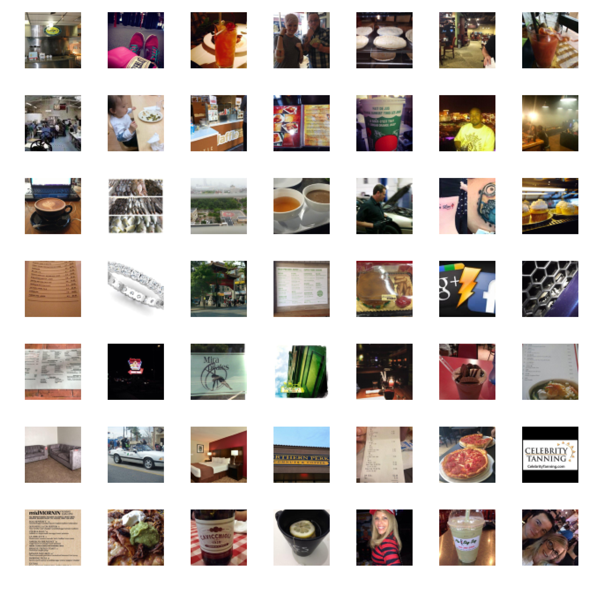
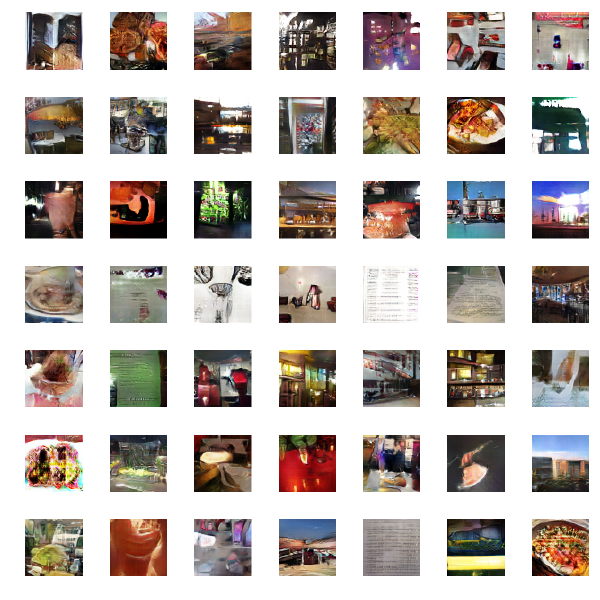
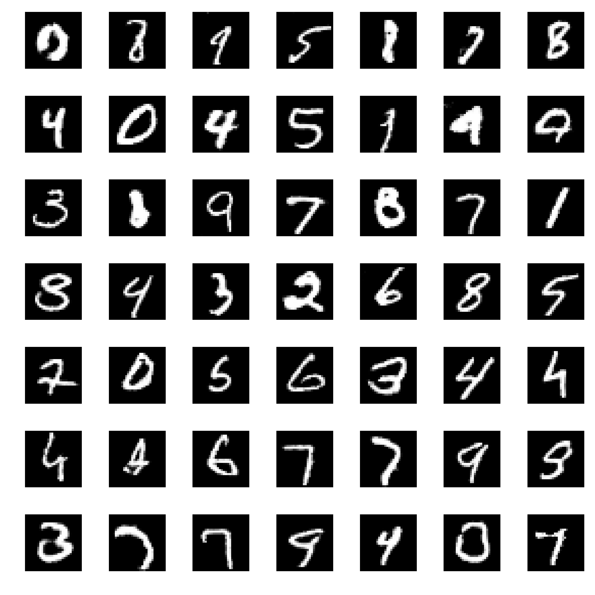
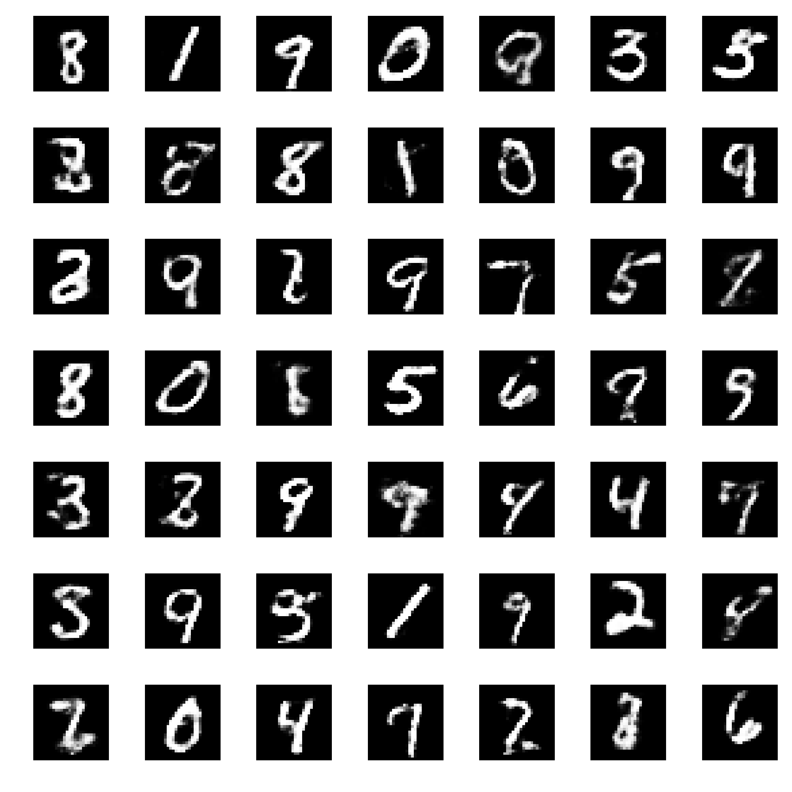

# GAN Models
Implementation of Generative Adversarial Network (GAN) with keras. With applications on MNIST and Yelp photo generation.

This repo implements the algorithms described in the following 3 papers:

- DCGAN (https://arxiv.org/abs/1511.06434)
- Wasserstein GAN (https://arxiv.org/abs/1701.07875)
- Improved Training of Wasserstein GANs (https://arxiv.org/abs/1704.00028)
 
See the [examples folder](./examples) for how to apply the model on MNIST and Yelp photos.

## Yelp Photo Results

Real photos
 

Generated fake photos (with DCGAN architecture + Improved WGAN training)

## MNIST Results
Original DCGAN

MLP + Improved WGAN

